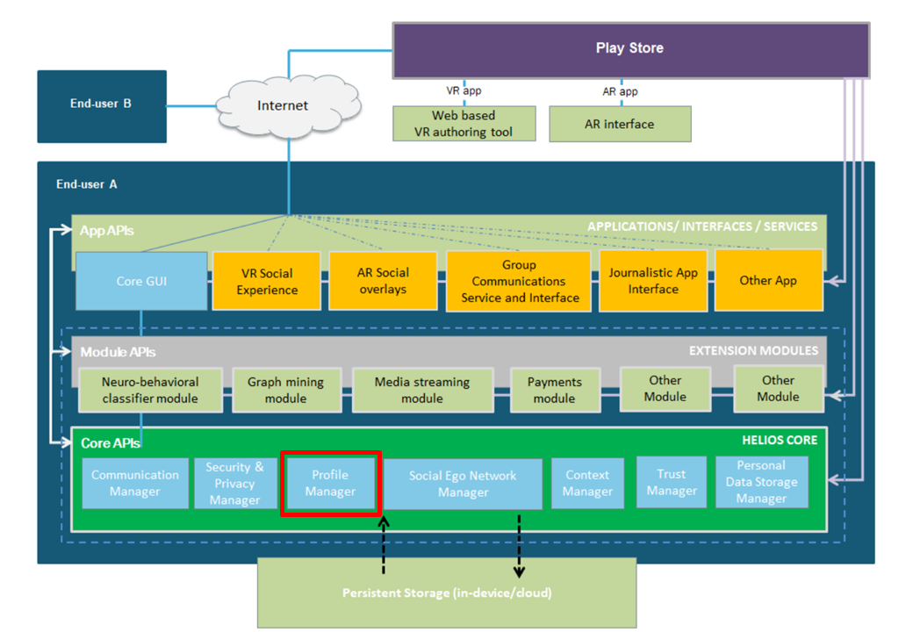

# HELIOS Profile API #

## Introduction ##

The Profile Manager handles user account creation and creation of
associated keys. At least one key pair is needed for signing and
verification of electronic signatures and another public key - private
key pair is needed for encryption and decryption. Other keys are
needed for encrypting contents the user is producing and/or sending to
other users. Uses Identity manager and personal data storage manager
to handle profile information control, as well. This manager also
interfaces with the functionality offered by, e.g., Security & Privacy
Manager.

HELIOS Profile API is one of the HELIOS Core APIs as highlighted in
the picture below:



## API usage ##

See javadocs in [javadocs.zip](doc/javadocs.zip).

### Introduction ###

Application should include this library by adding it in the specific build.gradle file. An example:


```
configurations.all {
    resolutionStrategy.dependencySubstitution {
        substitute module("eu.h2020.helios_social.core.messaging:profile") with project(':profile')
    }
}

dependencies {
    implementation 'eu.h2020.helios_social.core.messaging:profile:1.0.0'
}
```


### Dependencies ### 

This module depends on eu.h2020.helios_social.core.security.


### HeliosProfileManager ### 

Provides the main functionalities, e.g. load and store attributes from shared preferences. 

Apps are expected to use `HeliosProfileManager` singleton class to access the functionality. Applications
should call the `getInstance();` method in order to get a singleton object.

`HeliosProfileManager profileMgr = HeliosProfileManager.getInstance();`

Thereafter, the app can load/store values, e.g., to check and load/store user UUID:

```
	// Get default preferences userId
        String userId = profileMgr.load(this, getString(R.string.setting_user_id), android.content.Context.MODE_PRIVATE);
        if (userId.isEmpty()) {
            userId = UUID.randomUUID().toString();
            profileMgr.store(this, getString(R.string.setting_user_id), userId, android.content.Context.MODE_PRIVATE);
            Log.d(TAG, "Initialization, userId not found, now set as " + userId);
        } else {
            Log.d(TAG, "Initialization, userId was set as " + userId);
        }
```

This uses the key eu.h2020.helios_social.USER_ID as set in:

`<string name="setting_user_id">eu.h2020.helios_social.USER_ID</string>`

The other values used in the current integration can be seen from TestClient app's resources under strings.xml

Check out TestClient's MainActivity.checkUserAccount method for further examples. For instance, saved home location is loaded
when the application is started by:

`profileMgr.load(context, "homelat");`


### HeliosUserData ### 

Provides a cache file for the profile attributes. 

For example, to get the UUID of the user:

`String mUserId = HeliosUserData.getInstance().getValue(getString(R.string.setting_user_id));`


### Future work ###

* We should include the most common used profile attributes in the library itself. Although, the profile manager requirement was to be general
and it should be easy to extend in case new attributes are needed, therefore it implements a key-value structure at the moment. 
* Add suggestions here or create a new issue under this repository.


## Android Studio project structure ##

This Android Studio 3.5 project contains the following components:

* app - Profile API test application

* doc - Additional documentation files

* lib - Profile API implementation
